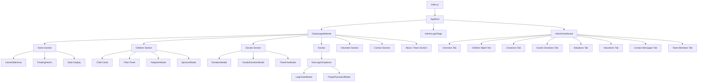
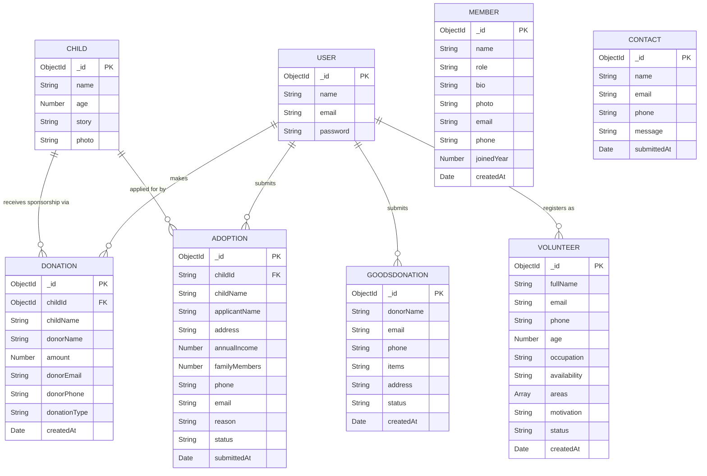

# MakeLife NGO Management System
## Comprehensive Project Documentation
### Final Year Capstone Project

---

# TABLE OF CONTENTS

1. Software Requirements Specification (SRS)
2. Data Flow Diagram (DFD)
3. Frontend Architecture Diagram
4. Backend Architecture Diagram
5. Entity Relationship (ER) Diagram

---

# PART 1: SOFTWARE REQUIREMENTS SPECIFICATION (SRS)

---

## 1.1 Introduction

### 1.1.1 Purpose
This document presents the Software Requirements Specification (SRS) for **MakeLife** — a full-stack NGO Management Web Application. It defines the functional and non-functional requirements, system architecture, and use case descriptions for the system. This document is intended for developers, academic evaluators, and project stakeholders.

### 1.1.2 Project Overview
MakeLife is a MERN stack (MongoDB, Express.js, React.js, Node.js) web application designed to digitize and streamline the operations of a child welfare non-governmental organization (NGO). The platform provides a public-facing website for donors, volunteers, and adoptive families, alongside a secure administrative dashboard for NGO staff to manage all operations.

### 1.1.3 Scope
The system covers the following operational domains:
- Child profile management and public listing
- Monetary donation processing (general and child sponsorship)
- Goods/in-kind donation management
- Adoption application submission and review
- Volunteer registration and management
- Team member profile management
- Public contact and inquiry handling
- Admin authentication and dashboard

### 1.1.4 Definitions and Acronyms

| Term         | Definition                                                  |
|--------------|-------------------------------------------------------------|
| NGO          | Non-Governmental Organization                               |
| MERN         | MongoDB, Express.js, React.js, Node.js                      |
| API          | Application Programming Interface                           |
| CRUD         | Create, Read, Update, Delete                                |
| JWT          | JSON Web Token                                              |
| REST         | Representational State Transfer                             |
| SRS          | Software Requirements Specification                         |
| Admin        | Authorized NGO staff with full system access                |
| Donor        | A user who contributes money or goods                       |
| Volunteer    | A user who registers to offer their time and skills         |
| Applicant    | A user who submits an adoption application                  |

### 1.1.5 References
- MongoDB Documentation: https://www.mongodb.com/docs
- Express.js Documentation: https://expressjs.com
- React.js Documentation: https://react.dev
- Node.js Documentation: https://nodejs.org/en/docs

---

## 1.2 Overall Description

### 1.2.1 Product Perspective
MakeLife is a standalone web application with a decoupled frontend and backend architecture. The frontend is a React.js single-page application (SPA) that communicates with a RESTful Node.js/Express.js backend via HTTP API calls. Data is persisted in a MongoDB NoSQL database hosted on MongoDB Atlas.

### 1.2.2 Product Functions (Summary)

| Module                  | Key Functions                                                  |
|-------------------------|----------------------------------------------------------------|
| Authentication          | User registration, login, admin sign-in                        |
| Child Management        | Add, view, delete child profiles with photos                   |
| Monetary Donations      | General donations, child sponsorship, donor tracking           |
| Goods Donations         | Multi-category goods submission, admin status management       |
| Adoption Management     | Application submission, duplicate prevention, status review    |
| Volunteer Management    | Registration, area/availability selection, status tracking     |
| Team Members            | Profile management with photo uploads                          |
| Contact / Inquiries     | Public contact form, admin inbox management                    |
| Admin Dashboard         | Statistics overview, full CRUD across all modules              |

### 1.2.3 User Classes and Characteristics

**1. Public Visitor (Unauthenticated)**
- Can browse children profiles, view team members, read about the NGO
- Can submit contact inquiries
- Must register/login to donate or apply for adoption

**2. Registered User (Authenticated)**
- Can make monetary donations (general or sponsorship)
- Can submit goods donation requests
- Can submit adoption applications
- Can register as a volunteer

**3. Administrator**
- Full access to the admin dashboard
- Can manage all entities (children, donations, adoptions, volunteers, members, messages)
- Authenticated via hardcoded credentials with environment variable support

### 1.2.4 Operating Environment
- **Frontend:** React.js 18+, runs in modern web browsers (Chrome, Firefox, Edge, Safari)
- **Backend:** Node.js 18+, Express.js 4+
- **Database:** MongoDB (via Mongoose ODM), hosted on MongoDB Atlas
- **File Storage:** Local filesystem (`/uploads` directory) served as static files
- **Deployment:** Compatible with cloud platforms (Render, Railway, Vercel, etc.)

### 1.2.5 Assumptions and Dependencies
- A stable internet connection is required for all operations
- MongoDB Atlas cluster must be accessible via the `MONGO_URI` environment variable
- The backend must be running and accessible at the URL defined in `REACT_APP_API_URL`
- File uploads are limited to 5MB per image

---

## 1.3 Functional Requirements

### FR-01: User Authentication

| ID     | Requirement                                                                 |
|--------|-----------------------------------------------------------------------------|
| FR-01.1 | The system shall allow new users to register with name, email, and password |
| FR-01.2 | The system shall allow registered users to log in with email and password   |
| FR-01.3 | The system shall allow admin login via username/email and password          |
| FR-01.4 | The system shall issue an authentication token upon successful login        |
| FR-01.5 | The system shall support logout by clearing the stored token                |

### FR-02: Child Profile Management

| ID     | Requirement                                                                 |
|--------|-----------------------------------------------------------------------------|
| FR-02.1 | The system shall allow admins to add child profiles with name, age, story, and photo |
| FR-02.2 | The system shall display all child profiles publicly with filtering options |
| FR-02.3 | The system shall allow filtering children by age range and gender           |
| FR-02.4 | The system shall allow admins to delete child profiles                      |

### FR-03: Monetary Donation Management

| ID     | Requirement                                                                 |
|--------|-----------------------------------------------------------------------------|
| FR-03.1 | The system shall allow users to make general monetary donations             |
| FR-03.2 | The system shall allow users to sponsor a specific child                    |
| FR-03.3 | The system shall record donor name, email, phone, and amount                |
| FR-03.4 | The system shall classify donations as 'general' or 'sponsorship'           |
| FR-03.5 | The system shall display total funds raised and donor count on the homepage |

### FR-04: Goods Donation Management

| ID     | Requirement                                                                 |
|--------|-----------------------------------------------------------------------------|
| FR-04.1 | The system shall allow users to submit goods donation requests              |
| FR-04.2 | The system shall support multiple goods categories: food, clothing, books, toys, hygiene, blankets, stationery, footwear |
| FR-04.3 | The system shall capture category-specific details for each goods type      |
| FR-04.4 | The system shall allow admins to approve or reject goods donation requests  |

### FR-05: Adoption Application Management

| ID     | Requirement                                                                 |
|--------|-----------------------------------------------------------------------------|
| FR-05.1 | The system shall allow authenticated users to submit adoption applications  |
| FR-05.2 | The system shall prevent duplicate pending applications for the same child  |
| FR-05.3 | The system shall capture applicant details: name, address, income, family size, contact, reason |
| FR-05.4 | The system shall allow admins to approve or reject adoption applications    |
| FR-05.5 | The system shall allow admins to view all applications per child            |

### FR-06: Volunteer Management

| ID     | Requirement                                                                 |
|--------|-----------------------------------------------------------------------------|
| FR-06.1 | The system shall allow users to register as volunteers                      |
| FR-06.2 | The system shall capture volunteer details: name, email, phone, age, occupation, availability, areas of interest, motivation |
| FR-06.3 | The system shall allow admins to update volunteer status                    |
| FR-06.4 | The system shall allow admins to delete volunteer records                   |

### FR-07: Team Member Management

| ID     | Requirement                                                                 |
|--------|-----------------------------------------------------------------------------|
| FR-07.1 | The system shall allow admins to add team member profiles with photo upload |
| FR-07.2 | The system shall display team members publicly on the About/Team page       |
| FR-07.3 | The system shall allow admins to update and delete member profiles          |

### FR-08: Contact / Inquiry Management

| ID     | Requirement                                                                 |
|--------|-----------------------------------------------------------------------------|
| FR-08.1 | The system shall allow any visitor to submit a contact inquiry              |
| FR-08.2 | The system shall store contact messages with name, email, phone, and message |
| FR-08.3 | The system shall allow admins to view and delete contact messages           |

### FR-09: Admin Dashboard

| ID     | Requirement                                                                 |
|--------|-----------------------------------------------------------------------------|
| FR-09.1 | The system shall provide an admin dashboard with statistics overview        |
| FR-09.2 | The system shall display total donations, donor count, volunteer count, and pending applications |
| FR-09.3 | The system shall provide tabbed navigation for all management modules       |

---

## 1.4 Non-Functional Requirements

### NFR-01: Performance
- The system shall load the homepage within 3 seconds on a standard broadband connection.
- API responses shall be returned within 2 seconds under normal load.
- The donation statistics shall auto-refresh every 30 seconds.

### NFR-02: Security
- Admin credentials shall be configurable via environment variables.
- Authentication tokens shall be stored in `localStorage` and sent via `Authorization` headers.
- File uploads shall be restricted to image types (JPG, PNG, JPEG) with a 5MB size limit.
- CORS shall be configured to control cross-origin access.

### NFR-03: Usability
- The interface shall be fully responsive across mobile, tablet, and desktop screen sizes.
- The system shall provide clear success and error feedback for all user actions.
- Navigation shall be intuitive with a persistent top navigation bar.

### NFR-04: Reliability
- The system shall handle API errors gracefully and display fallback data where applicable.
- The system shall prevent duplicate adoption applications at the database level.

### NFR-05: Maintainability
- The backend shall follow a modular route/model architecture.
- Environment-specific configuration shall be managed via `.env` files.

### NFR-06: Scalability
- The MongoDB schema design shall support future addition of new fields without breaking existing functionality.
- The REST API shall be stateless to support horizontal scaling.

---

## 1.5 System Architecture

MakeLife follows a **three-tier client-server architecture**:

```
┌─────────────────────────────────────────────────────────┐
│                    PRESENTATION TIER                     │
│              React.js Single Page Application            │
│         (Public Website + Admin Dashboard)               │
└──────────────────────┬──────────────────────────────────┘
                       │ HTTP/REST API (JSON)
┌──────────────────────▼──────────────────────────────────┐
│                    APPLICATION TIER                      │
│           Node.js + Express.js REST API Server           │
│    (Routes → Controllers → Models → Mongoose ODM)        │
└──────────────────────┬──────────────────────────────────┘
                       │ Mongoose ODM
┌──────────────────────▼──────────────────────────────────┐
│                      DATA TIER                           │
│              MongoDB Atlas (NoSQL Database)              │
│   Collections: Users, Children, Donations, Adoptions,   │
│   GoodsDonations, Volunteers, Members, Contacts          │
└─────────────────────────────────────────────────────────┘
```

---

## 1.6 Use Case Descriptions

### UC-01: Make a Monetary Donation

| Field         | Description                                                        |
|---------------|--------------------------------------------------------------------|
| Use Case ID   | UC-01                                                              |
| Name          | Make a Monetary Donation                                           |
| Actor         | Registered User                                                    |
| Precondition  | User is logged in                                                  |
| Trigger       | User clicks "Donate" and selects a monetary amount                 |
| Main Flow     | 1. User navigates to Donate section. 2. Selects amount (preset or custom). 3. Enters donor name, email, phone. 4. Submits form. 5. System saves donation and shows thank-you modal. |
| Alternate Flow | User selects a specific child → donation is classified as 'sponsorship' |
| Postcondition | Donation record saved; statistics updated                          |

### UC-02: Submit Adoption Application

| Field         | Description                                                        |
|---------------|--------------------------------------------------------------------|
| Use Case ID   | UC-02                                                              |
| Name          | Submit Adoption Application                                        |
| Actor         | Registered User                                                    |
| Precondition  | User is logged in; child profile exists                            |
| Trigger       | User clicks "Adopt" on a child's profile card                      |
| Main Flow     | 1. User opens adoption modal. 2. Fills in applicant details. 3. Submits form. 4. System checks for duplicate pending application. 5. Saves application with 'pending' status. |
| Alternate Flow | Duplicate found → system returns 409 error with message           |
| Postcondition | Adoption application saved; admin notified via dashboard           |

### UC-03: Register as Volunteer

| Field         | Description                                                        |
|---------------|--------------------------------------------------------------------|
| Use Case ID   | UC-03                                                              |
| Name          | Register as Volunteer                                              |
| Actor         | Public Visitor / Registered User                                   |
| Precondition  | None                                                               |
| Trigger       | User navigates to Volunteer section and fills the form             |
| Main Flow     | 1. User fills volunteer form (name, email, motivation, areas). 2. Submits form. 3. System validates required fields. 4. Saves volunteer record with 'pending' status. |
| Postcondition | Volunteer record saved; visible in admin dashboard                 |

### UC-04: Admin Manages Adoption Applications

| Field         | Description                                                        |
|---------------|--------------------------------------------------------------------|
| Use Case ID   | UC-04                                                              |
| Name          | Admin Reviews Adoption Application                                 |
| Actor         | Administrator                                                      |
| Precondition  | Admin is authenticated                                             |
| Trigger       | Admin opens Adoptions tab in dashboard                             |
| Main Flow     | 1. Admin views list of applications. 2. Selects an application. 3. Clicks Approve or Reject. 4. System updates status via PATCH API. |
| Postcondition | Application status updated to 'approved' or 'rejected'            |

### UC-05: Submit Goods Donation

| Field         | Description                                                        |
|---------------|--------------------------------------------------------------------|
| Use Case ID   | UC-05                                                              |
| Name          | Submit Goods Donation                                              |
| Actor         | Registered User                                                    |
| Precondition  | User is logged in                                                  |
| Trigger       | User selects "Donate Goods" tab and selects item categories        |
| Main Flow     | 1. User selects goods category (food, clothing, books, etc.). 2. Fills category-specific details. 3. Provides contact and address. 4. Submits form. 5. System saves with 'pending' status. |
| Postcondition | Goods donation record saved; admin can approve/reject              |

---

---

# PART 2: DATA FLOW DIAGRAM (DFD)

---

## 2.1 Level 0 — Context Diagram

The context diagram shows the MakeLife system as a single process interacting with all external entities.

```
                        ┌─────────────────────────────────────────────────────────────────┐
                        │                                                                 │
  ┌──────────────┐      │                                                                 │      ┌──────────────┐
  │              │─────▶│  Donation Data, Goods Donation, Adoption Application,           │─────▶│              │
  │  Registered  │      │  Volunteer Registration, Contact Inquiry                        │      │  MongoDB     │
  │    User      │◀─────│                                                                 │◀─────│  Database    │
  │              │      │                                                                 │      │              │
  └──────────────┘      │                                                                 │      └──────────────┘
                        │                                                                 │
  ┌──────────────┐      │              MAKELIFE SYSTEM                                    │
  │              │─────▶│                                                                 │
  │   Public     │      │  (Web Application: React Frontend + Node/Express Backend)       │
  │   Visitor    │◀─────│                                                                 │
  │              │      │                                                                 │
  └──────────────┘      │                                                                 │
                        │                                                                 │
  ┌──────────────┐      │                                                                 │
  │              │─────▶│  Admin Credentials, CRUD Operations, Status Updates             │
  │ Administrator│      │                                                                 │
  │              │◀─────│  Dashboard Data, Reports, Managed Records                       │
  └──────────────┘      │                                                                 │
                        └─────────────────────────────────────────────────────────────────┘
```

**External Entities:**
- **Registered User:** Authenticated user who donates, applies for adoption, or volunteers.
- **Public Visitor:** Unauthenticated user who browses children, views team, or submits contact.
- **Administrator:** NGO staff who manages all records via the admin dashboard.
- **MongoDB Database:** Persistent data store for all system entities.

---

## 2.2 Level 1 DFD

The Level 1 DFD decomposes the system into its major functional processes.

```
                                ┌─────────────────────────────────────────────────────────────────────────────────┐
                                │                          MAKELIFE SYSTEM — LEVEL 1 DFD                          │
                                └─────────────────────────────────────────────────────────────────────────────────┘

  ┌──────────────┐   credentials    ┌──────────────────┐   user record    ┌──────────────┐
  │   User /     │─────────────────▶│  P1: AUTHENTICATE│─────────────────▶│  DS1: Users  │
  │   Admin      │◀─────────────────│  & AUTHORIZE     │◀─────────────────│  Collection  │
  └──────────────┘   auth token     └──────────────────┘   lookup result  └──────────────┘

  ┌──────────────┐   child browse   ┌──────────────────┐   read/write     ┌──────────────┐
  │   Public     │─────────────────▶│  P2: MANAGE      │─────────────────▶│  DS2:Children│
  │   Visitor    │◀─────────────────│  CHILDREN        │◀─────────────────│  Collection  │
  └──────────────┘   child profiles └──────────────────┘   child data     └──────────────┘
                                            ▲
                                            │ admin CRUD
                                    ┌───────┴──────┐
                                    │ Administrator│
                                    └──────────────┘

  ┌──────────────┐  donation data   ┌──────────────────┐   save donation  ┌──────────────┐
  │  Registered  │─────────────────▶│  P3: PROCESS     │─────────────────▶│  DS3:Donation│
  │    User      │◀─────────────────│  DONATIONS       │◀─────────────────│  Collection  │
  └──────────────┘  confirmation    └──────────────────┘   donation list  └──────────────┘

  ┌──────────────┐  goods form      ┌──────────────────┐   save goods     ┌──────────────┐
  │  Registered  │─────────────────▶│  P4: MANAGE      │─────────────────▶│  DS4:Goods   │
  │    User      │◀─────────────────│  GOODS DONATIONS │◀─────────────────│  Donations   │
  └──────────────┘  status update   └──────────────────┘   goods list     └──────────────┘
                                            ▲
                                            │ approve/reject
                                    ┌───────┴──────┐
                                    │ Administrator│
                                    └──────────────┘

  ┌──────────────┐  adoption form   ┌──────────────────┐   save app       ┌──────────────┐
  │  Registered  │─────────────────▶│  P5: PROCESS     │─────────────────▶│  DS5:Adoption│
  │    User      │◀─────────────────│  ADOPTIONS       │◀─────────────────│  Applications│
  └──────────────┘  app status      └──────────────────┘   app list       └──────────────┘
                                            ▲
                                            │ review & update status
                                    ┌───────┴──────┐
                                    │ Administrator│
                                    └──────────────┘

  ┌──────────────┐  volunteer form  ┌──────────────────┐   save record    ┌──────────────┐
  │   Visitor /  │─────────────────▶│  P6: MANAGE      │─────────────────▶│  DS6:Volunteer│
  │    User      │◀─────────────────│  VOLUNTEERS      │◀─────────────────│  Collection  │
  └──────────────┘  confirmation    └──────────────────┘   volunteer list └──────────────┘

  ┌──────────────┐  contact form    ┌──────────────────┐   save message   ┌──────────────┐
  │   Public     │─────────────────▶│  P7: HANDLE      │─────────────────▶│  DS7:Contact │
  │   Visitor    │◀─────────────────│  CONTACT         │◀─────────────────│  Messages    │
  └──────────────┘  confirmation    └──────────────────┘   message list   └──────────────┘

  ┌──────────────┐  member data     ┌──────────────────┐   save member    ┌──────────────┐
  │ Administrator│─────────────────▶│  P8: MANAGE      │─────────────────▶│  DS8:Members │
  │              │◀─────────────────│  TEAM MEMBERS    │◀─────────────────│  Collection  │
  └──────────────┘  member list     └──────────────────┘   member data    └──────────────┘
```

### Component Explanations

| Process | Name                  | Description                                                                                   |
|---------|-----------------------|-----------------------------------------------------------------------------------------------|
| P1      | Authenticate & Authorize | Handles user registration, login, and admin sign-in. Issues tokens and validates credentials. |
| P2      | Manage Children       | Stores and retrieves child profiles. Supports public browsing and admin CRUD operations.       |
| P3      | Process Donations     | Accepts monetary donations (general or sponsorship), records donor info, updates statistics.  |
| P4      | Manage Goods Donations | Accepts multi-category goods donation forms, stores details, allows admin status management.  |
| P5      | Process Adoptions     | Validates and stores adoption applications, prevents duplicates, supports admin review.        |
| P6      | Manage Volunteers     | Registers volunteers, stores availability and skills, allows admin status updates.            |
| P7      | Handle Contact        | Stores public contact inquiries, provides admin inbox for viewing and deleting messages.       |
| P8      | Manage Team Members   | Allows admin to add/edit/delete team member profiles with photo uploads.                      |

| Data Store | Name                | Description                                              |
|------------|---------------------|----------------------------------------------------------|
| DS1        | Users Collection    | Stores registered user accounts (name, email, password)  |
| DS2        | Children Collection | Stores child profiles (name, age, story, photo)          |
| DS3        | Donations Collection | Stores monetary donation records                        |
| DS4        | Goods Donations     | Stores goods donation requests with category details     |
| DS5        | Adoption Applications | Stores adoption applications with status tracking      |
| DS6        | Volunteers Collection | Stores volunteer registrations                         |
| DS7        | Contact Messages    | Stores public contact form submissions                   |
| DS8        | Members Collection  | Stores NGO team member profiles                          |

---

---

# PART 3: FRONTEND ARCHITECTURE DIAGRAM

---

## 3.1 Component Structure Overview

The frontend is a React.js Single Page Application (SPA) contained in a single `App.js` file. It uses a state-driven view system rather than a router library.

```
┌─────────────────────────────────────────────────────────────────────────────────────────┐
│                              FRONTEND ARCHITECTURE                                      │
│                         React.js SPA (frontend_backup/src)                              │
└─────────────────────────────────────────────────────────────────────────────────────────┘

                              ┌──────────────────┐
                              │    index.js       │
                              │  (Entry Point)    │
                              └────────┬─────────┘
                                       │ renders
                              ┌────────▼─────────┐
                              │    AppRoot        │
                              │  (Root Component) │
                              │                   │
                              │  State: view       │
                              │  - 'app'           │
                              │  - 'admin-auth'    │
                              │  - 'admin-dash'    │
                              └────────┬─────────┘
                                       │
              ┌────────────────────────┼────────────────────────┐
              │                        │                        │
    ┌─────────▼──────────┐  ┌──────────▼──────────┐  ┌─────────▼──────────┐
    │  OrphanageWebsite  │  │  AdminLoginPage      │  │  AdminDashboard    │
    │  (Public Website)  │  │  (Admin Auth)        │  │  (Admin Panel)     │
    └─────────┬──────────┘  └─────────────────────┘  └─────────┬──────────┘
              │                                                  │
              │                                                  │
    ┌─────────▼──────────────────────────────────┐   ┌──────────▼──────────────────────────────┐
    │           PUBLIC SECTIONS (via activeSection state)        │       ADMIN TABS              │
    │                                            │   │                                          │
    │  ┌──────────┐  ┌──────────┐  ┌──────────┐ │   │  ┌──────────┐  ┌──────────┐             │
    │  │  Home    │  │ Children │  │  Donate  │ │   │  │ Overview │  │ Children │             │
    │  │ Section  │  │ Section  │  │ Section  │ │   │  │   Stats  │  │  Mgmt    │             │
    │  └──────────┘  └──────────┘  └──────────┘ │   │  └──────────┘  └──────────┘             │
    │                                            │   │                                          │
    │  ┌──────────┐  ┌──────────┐  ┌──────────┐ │   │  ┌──────────┐  ┌──────────┐             │
    │  │Volunteer │  │ Contact  │  │  About / │ │   │  │Donations │  │  Goods   │             │
    │  │ Section  │  │ Section  │  │  Team    │ │   │  │  View    │  │Donations │             │
    │  └──────────┘  └──────────┘  └──────────┘ │   │  └──────────┘  └──────────┘             │
    │                                            │   │                                          │
    └────────────────────────────────────────────┘   │  ┌──────────┐  ┌──────────┐             │
                                                     │  │Adoptions │  │Volunteers│             │
                                                     │  │  Review  │  │  Mgmt    │             │
                                                     │  └──────────┘  └──────────┘             │
                                                     │                                          │
                                                     │  ┌──────────┐  ┌──────────┐             │
                                                     │  │ Contact  │  │  Team    │             │
                                                     │  │ Messages │  │ Members  │             │
                                                     │  └──────────┘  └──────────┘             │
                                                     └──────────────────────────────────────────┘
```

---

## 3.2 Modals and Shared Components

```
┌─────────────────────────────────────────────────────────────────────────────────────────┐
│                           SHARED / MODAL COMPONENTS                                     │
├─────────────────────────────────────────────────────────────────────────────────────────┤
│                                                                                         │
│  ┌─────────────────────┐   ┌─────────────────────┐   ┌─────────────────────┐           │
│  │  NavLoginDropdown   │   │   LoginGateModal     │   │  ForgotPasswordModal│           │
│  │  (Sign In/Sign Up   │   │  (Full-screen auth   │   │  (Password reset    │           │
│  │   in nav bar)       │   │   gate for actions)  │   │   flow)             │           │
│  └─────────────────────┘   └─────────────────────┘   └─────────────────────┘           │
│                                                                                         │
│  ┌─────────────────────┐   ┌─────────────────────┐   ┌─────────────────────┐           │
│  │  DonationModal      │   │  SponsorModal        │   │  AdoptionModal      │           │
│  │  (General donation  │   │  (Child sponsorship  │   │  (Adoption form     │           │
│  │   quick picks)      │   │   with amount input) │   │   with validation)  │           │
│  └─────────────────────┘   └─────────────────────┘   └─────────────────────┘           │
│                                                                                         │
│  ┌─────────────────────┐   ┌─────────────────────┐   ┌─────────────────────┐           │
│  │  GoodsDonationModal │   │  ThankYouModal       │   │  AlertModal /       │           │
│  │  (Multi-category    │   │  (Post-donation      │   │  ConfirmModal       │           │
│  │   goods form)       │   │   confirmation)      │   │  (Global feedback)  │           │
│  └─────────────────────┘   └─────────────────────┘   └─────────────────────┘           │
│                                                                                         │
│  ┌─────────────────────┐   ┌─────────────────────┐                                     │
│  │  HomeSlideshow      │   │  FloatingHearts      │                                     │
│  │  (Auto-rotating     │   │  (Animated           │                                     │
│  │   image carousel)   │   │   background decor)  │                                     │
│  └─────────────────────┘   └─────────────────────┘                                     │
│                                                                                         │
└─────────────────────────────────────────────────────────────────────────────────────────┘
```

---

## 3.3 Data Flow Between Frontend Components

```
┌─────────────────────────────────────────────────────────────────────────────────────────┐
│                         FRONTEND DATA FLOW                                              │
└─────────────────────────────────────────────────────────────────────────────────────────┘

  User Action
      │
      ▼
  ┌──────────────────────────────────────────────────────────────────────────────────────┐
  │  React Component (e.g., Children Section)                                            │
  │                                                                                      │
  │  1. useEffect() → calls apiFetch('/children')                                        │
  │  2. apiFetch() → reads token from localStorage → sends HTTP GET to backend API       │
  │  3. Response → setState(children) → component re-renders with data                   │
  │  4. User clicks "Adopt" → checks if logged in → opens AdoptionModal                  │
  │  5. User submits form → apiFetch POST '/adoptions' → success/error feedback           │
  └──────────────────────────────────────────────────────────────────────────────────────┘

  ┌──────────────────────────────────────────────────────────────────────────────────────┐
  │  Authentication Flow                                                                 │
  │                                                                                      │
  │  NavLoginDropdown → POST /api/auth/login → token stored in localStorage              │
  │  AppRoot.currentUser state updated → OrphanageWebsite receives currentUser prop      │
  │  Protected actions check currentUser → show LoginGateModal if null                   │
  └──────────────────────────────────────────────────────────────────────────────────────┘

  ┌──────────────────────────────────────────────────────────────────────────────────────┐
  │  Admin Flow                                                                          │
  │                                                                                      │
  │  AppRoot view='admin-auth' → AdminLoginPage → POST /api/auth/admin/signin            │
  │  → token stored → AppRoot view='admin-dash' → AdminDashboard rendered                │
  │  AdminDashboard fetches all data on mount → displays in tabbed interface             │
  └──────────────────────────────────────────────────────────────────────────────────────┘
```

---

## 3.4 Mermaid Diagram — Frontend Component Tree



---

---

# PART 4: BACKEND ARCHITECTURE DIAGRAM

---

## 4.1 Backend Architecture Overview

```
┌─────────────────────────────────────────────────────────────────────────────────────────┐
│                          BACKEND ARCHITECTURE — Node.js / Express.js                   │
└─────────────────────────────────────────────────────────────────────────────────────────┘

  ┌──────────────────────────────────────────────────────────────────────────────────────┐
  │                              server.js (Entry Point)                                 │
  │                                                                                      │
  │  - Loads environment variables (.env)                                                │
  │  - Initializes Express application                                                   │
  │  - Configures CORS middleware (all origins, all methods)                             │
  │  - Configures JSON body parser (10MB limit)                                          │
  │  - Serves /uploads as static file directory                                          │
  │  - Connects to MongoDB via Mongoose (MONGO_URI)                                      │
  │  - Registers all route modules                                                       │
  │  - Starts HTTP server on configured PORT                                             │
  └──────────────────────────────────────────────────────────────────────────────────────┘
                                          │
                    ┌─────────────────────▼──────────────────────┐
                    │              MIDDLEWARE LAYER               │
                    │  cors() → json() → urlencoded() → logger   │
                    └─────────────────────┬──────────────────────┘
                                          │
          ┌───────────────────────────────▼──────────────────────────────────┐
          │                         ROUTES LAYER                             │
          │                                                                  │
          │  /api/auth          → authRoutes.js                              │
          │  /api/children      → childRoutes.js                             │
          │  /api/donations     → donationRoutes.js                          │
          │  /api/goods-donation→ goodsDonationRoutes.js                     │
          │  /api/adoptions     → adoptionRoutes.js                          │
          │  /api/volunteers    → volunteerRoutes.js                         │
          │  /api/contact       → contactRoutes.js                           │
          │  /api/members       → memberRoutes.js                            │
          │  /api/upload        → uploadRoutes.js                            │
          └───────────────────────────────┬──────────────────────────────────┘
                                          │
          ┌───────────────────────────────▼──────────────────────────────────┐
          │                         MODELS LAYER (Mongoose ODM)              │
          │                                                                  │
          │  User.js            Child.js          Donation.js                │
          │  GoodsDonation.js   Adoption.js       Member.js                  │
          │  Contact.js         Volunteer.js (inline in route)               │
          └───────────────────────────────┬──────────────────────────────────┘
                                          │
          ┌───────────────────────────────▼──────────────────────────────────┐
          │                         MongoDB Atlas                            │
          │                    (NoSQL Document Database)                     │
          └──────────────────────────────────────────────────────────────────┘
```

---

## 4.2 API Endpoint Reference

```
┌─────────────────────────────────────────────────────────────────────────────────────────┐
│                              REST API ENDPOINTS                                         │
├──────────────────────────┬────────────┬────────────────────────────────────────────────┤
│  Endpoint                │  Method    │  Description                                   │
├──────────────────────────┼────────────┼────────────────────────────────────────────────┤
│  /api/auth/register      │  POST      │  Register new user                             │
│  /api/auth/login         │  POST      │  User login                                    │
│  /api/auth/admin/signin  │  POST      │  Admin authentication                          │
├──────────────────────────┼────────────┼────────────────────────────────────────────────┤
│  /api/children           │  GET       │  Get all children                              │
│  /api/children           │  POST      │  Add new child (admin)                         │
│  /api/children/:id       │  DELETE    │  Delete child (admin)                          │
├──────────────────────────┼────────────┼────────────────────────────────────────────────┤
│  /api/donations          │  GET       │  Get all donations (admin)                     │
│  /api/donations          │  POST      │  Create monetary donation                      │
├──────────────────────────┼────────────┼────────────────────────────────────────────────┤
│  /api/goods-donation     │  GET       │  Get all goods donations (admin)               │
│  /api/goods-donation     │  POST      │  Submit goods donation                         │
│  /api/goods-donation/:id │  PATCH     │  Update goods donation status (admin)          │
├──────────────────────────┼────────────┼────────────────────────────────────────────────┤
│  /api/adoptions          │  GET       │  Get all adoption applications (admin)         │
│  /api/adoptions          │  POST      │  Submit adoption application                   │
│  /api/adoptions/:id      │  GET       │  Get single adoption                           │
│  /api/adoptions/:id/status│ PATCH     │  Update adoption status (admin)                │
│  /api/adoptions/:id      │  DELETE    │  Delete adoption (admin)                       │
│  /api/adoptions/child/:id│  GET       │  Get adoptions by child                        │
├──────────────────────────┼────────────┼────────────────────────────────────────────────┤
│  /api/volunteers         │  GET       │  Get all volunteers (admin)                    │
│  /api/volunteers         │  POST      │  Register as volunteer                         │
│  /api/volunteers/:id     │  PATCH     │  Update volunteer status (admin)               │
│  /api/volunteers/:id     │  DELETE    │  Delete volunteer (admin)                      │
├──────────────────────────┼────────────┼────────────────────────────────────────────────┤
│  /api/contact            │  GET       │  Get all contact messages (admin)              │
│  /api/contact            │  POST      │  Submit contact inquiry                        │
│  /api/contact/:id        │  DELETE    │  Delete contact message (admin)                │
├──────────────────────────┼────────────┼────────────────────────────────────────────────┤
│  /api/members            │  GET       │  Get all team members                          │
│  /api/members            │  POST      │  Add team member with photo (admin)            │
│  /api/members/:id        │  PUT       │  Update team member (admin)                    │
│  /api/members/:id        │  DELETE    │  Delete team member (admin)                    │
├──────────────────────────┼────────────┼────────────────────────────────────────────────┤
│  /api/upload             │  POST      │  Upload image file (multer)                    │
│  /uploads/:filename      │  GET       │  Serve static uploaded file                    │
└──────────────────────────┴────────────┴────────────────────────────────────────────────┘
```

---

## 4.3 Mermaid Diagram — Backend Architecture

```mermaid
graph TD
    Client[React Frontend] -->|HTTP Request| Server[server.js - Express App]

    Server --> MW[Middleware: CORS, JSON Parser, Logger]
    MW --> R1[authRoutes.js]
    MW --> R2[childRoutes.js]
    MW --> R3[donationRoutes.js]
    MW --> R4[goodsDonationRoutes.js]
    MW --> R5[adoptionRoutes.js]
    MW --> R6[volunteerRoutes.js]
    MW --> R7[contactRoutes.js]
    MW --> R8[memberRoutes.js]
    MW --> R9[uploadRoutes.js]

    R1 --> M1[User Model]
    R2 --> M2[Child Model]
    R3 --> M3[Donation Model]
    R4 --> M4[GoodsDonation Model]
    R5 --> M5[Adoption Model]
    R6 --> M6[Volunteer Schema inline]
    R7 --> M7[Contact Model]
    R8 --> M8[Member Model]
    R9 --> FS[/uploads - File System]

    M1 --> DB[(MongoDB Atlas)]
    M2 --> DB
    M3 --> DB
    M4 --> DB
    M5 --> DB
    M6 --> DB
    M7 --> DB
    M8 --> DB
```

---

## 4.4 Request-Response Lifecycle

```
  Browser / React App
        │
        │  HTTP Request (GET/POST/PATCH/DELETE)
        │  Headers: { Content-Type: application/json, Authorization: Bearer <token> }
        ▼
  ┌─────────────────────────────────────────────────────────────────────────────────────┐
  │  Express Server (server.js)                                                         │
  │                                                                                     │
  │  1. CORS middleware validates origin                                                │
  │  2. JSON body parser deserializes request body                                      │
  │  3. Logger middleware logs [METHOD] /path                                           │
  │  4. Router matches path to route handler                                            │
  │  5. Route handler:                                                                  │
  │     a. Validates request body / params                                              │
  │     b. Calls Mongoose model method (find / create / findByIdAndUpdate / etc.)       │
  │     c. MongoDB Atlas executes query                                                 │
  │     d. Result returned to route handler                                             │
  │     e. Route handler sends JSON response with status code                          │
  │  6. Response sent back to client                                                    │
  └─────────────────────────────────────────────────────────────────────────────────────┘
        │
        │  HTTP Response (JSON)
        │  Status: 200 / 201 / 400 / 401 / 404 / 409 / 500
        ▼
  React Component updates state → UI re-renders
```

---

---

# PART 5: ENTITY RELATIONSHIP (ER) DIAGRAM

---

## 5.1 Entities and Attributes

### Entity: User
| Attribute   | Type    | Constraint   |
|-------------|---------|--------------|
| _id         | ObjectId| Primary Key  |
| name        | String  |              |
| email       | String  |              |
| password    | String  |              |

### Entity: Child
| Attribute   | Type    | Constraint   |
|-------------|---------|--------------|
| _id         | ObjectId| Primary Key  |
| name        | String  |              |
| age         | Number  |              |
| story       | String  |              |
| photo       | String  |              |

### Entity: Donation
| Attribute    | Type    | Constraint              |
|--------------|---------|-------------------------|
| _id          | ObjectId| Primary Key             |
| donorName    | String  | Default: 'Anonymous'    |
| amount       | Number  | Required                |
| donorEmail   | String  |                         |
| donorPhone   | String  |                         |
| donationType | String  | Enum: general/sponsorship|
| childId      | ObjectId| Foreign Key → Child._id |
| childName    | String  |                         |
| createdAt    | Date    |                         |

### Entity: GoodsDonation
| Attribute    | Type    | Constraint                        |
|--------------|---------|-----------------------------------|
| _id          | ObjectId| Primary Key                       |
| donorName    | String  | Required                          |
| email        | String  |                                   |
| phone        | String  |                                   |
| items        | String  | Required (category)               |
| message      | String  |                                   |
| address      | String  |                                   |
| pincode      | String  |                                   |
| state        | String  |                                   |
| quantity     | String  |                                   |
| condition    | String  |                                   |
| [category fields] | String | Food/Clothing/Books/Toys/etc. |
| status       | String  | Enum: pending/approved/rejected   |
| createdAt    | Date    |                                   |

### Entity: Adoption
| Attribute     | Type    | Constraint                      |
|---------------|---------|---------------------------------|
| _id           | ObjectId| Primary Key                     |
| childId       | String  | References Child._id (as String)|
| childName     | String  | Required                        |
| applicantName | String  | Required                        |
| address       | String  | Required                        |
| annualIncome  | Number  | Required                        |
| familyMembers | Number  | Required                        |
| phone         | String  | Required                        |
| email         | String  | Required                        |
| reason        | String  | Required                        |
| status        | String  | Enum: pending/approved/rejected |
| submittedAt   | Date    |                                 |

### Entity: Volunteer
| Attribute    | Type    | Constraint                |
|--------------|---------|---------------------------|
| _id          | ObjectId| Primary Key               |
| fullName     | String  | Required                  |
| email        | String  | Required                  |
| phone        | String  |                           |
| age          | Number  |                           |
| occupation   | String  |                           |
| availability | String  | Default: 'flexible'       |
| areas        | [String]| Array of interest areas   |
| experience   | String  |                           |
| motivation   | String  | Required                  |
| status       | String  | Default: 'pending'        |
| createdAt    | Date    |                           |

### Entity: Member
| Attribute  | Type    | Constraint   |
|------------|---------|--------------|
| _id        | ObjectId| Primary Key  |
| name       | String  | Required     |
| role       | String  | Required     |
| bio        | String  |              |
| photo      | String  |              |
| email      | String  |              |
| phone      | String  |              |
| joinedYear | Number  |              |
| createdAt  | Date    | Auto         |
| updatedAt  | Date    | Auto         |

### Entity: Contact
| Attribute   | Type    | Constraint   |
|-------------|---------|--------------|
| _id         | ObjectId| Primary Key  |
| name        | String  | Required     |
| email       | String  | Required     |
| phone       | String  |              |
| message     | String  | Required     |
| submittedAt | Date    |              |

---

## 5.2 ER Diagram — ASCII Format

```
┌──────────────────────────────────────────────────────────────────────────────────────────┐
│                          ENTITY RELATIONSHIP DIAGRAM — MakeLife                          │
└──────────────────────────────────────────────────────────────────────────────────────────┘

  ┌─────────────────┐          ┌─────────────────────────────────────────────────────────┐
  │      USER       │          │                       CHILD                             │
  ├─────────────────┤          ├─────────────────────────────────────────────────────────┤
  │ PK _id          │          │ PK _id                                                  │
  │    name         │          │    name                                                 │
  │    email        │          │    age                                                  │
  │    password     │          │    story                                                │
  └────────┬────────┘          │    photo                                                │
           │                   └──────────────────┬──────────────────────────────────────┘
           │ registers/                            │
           │ submits                               │ 1
           │                                       │
           │ 1                          ┌──────────┴──────────────────────────────────────┐
           │                            │                                                 │
           │                     0..*   │                                          0..*   │
  ┌────────▼────────────────────────────▼──────┐  ┌──────────────────────────────────────▼──┐
  │              ADOPTION                      │  │              DONATION                    │
  ├────────────────────────────────────────────┤  ├──────────────────────────────────────────┤
  │ PK _id                                     │  │ PK _id                                   │
  │ FK childId ──────────────────────────────▶ │  │ FK childId ──────────────────────────── ▶│
  │    childName                               │  │    childName                             │
  │    applicantName                           │  │    donorName                             │
  │    address                                 │  │    amount                                │
  │    annualIncome                            │  │    donorEmail                            │
  │    familyMembers                           │  │    donorPhone                            │
  │    phone                                   │  │    donationType (general/sponsorship)    │
  │    email                                   │  │    createdAt                             │
  │    reason                                  │  └──────────────────────────────────────────┘
  │    status (pending/approved/rejected)      │
  │    submittedAt                             │
  └────────────────────────────────────────────┘

  ┌─────────────────────────────────────────────────────────────────────────────────────────┐
  │                           GOODS DONATION                                                │
  ├─────────────────────────────────────────────────────────────────────────────────────────┤
  │ PK _id                                                                                  │
  │    donorName, email, phone                                                              │
  │    items (category), message, address, pincode, state, quantity, condition              │
  │    [food/clothing/books/toys/hygiene/blanket/stationery/footwear specific fields]       │
  │    status (pending/approved/rejected)                                                   │
  │    createdAt                                                                            │
  └─────────────────────────────────────────────────────────────────────────────────────────┘
  (No FK — standalone entity, submitted by any user)

  ┌─────────────────────────────────────────────────────────────────────────────────────────┐
  │                              VOLUNTEER                                                  │
  ├─────────────────────────────────────────────────────────────────────────────────────────┤
  │ PK _id                                                                                  │
  │    fullName, email, phone, age, occupation                                              │
  │    availability, areas[ ], experience, motivation                                       │
  │    status (pending/approved/rejected)                                                   │
  │    createdAt                                                                            │
  └─────────────────────────────────────────────────────────────────────────────────────────┘
  (No FK — standalone entity)

  ┌─────────────────────────────────────────────────────────────────────────────────────────┐
  │                               MEMBER                                                    │
  ├─────────────────────────────────────────────────────────────────────────────────────────┤
  │ PK _id                                                                                  │
  │    name, role, bio, photo, email, phone, joinedYear                                     │
  │    createdAt, updatedAt                                                                 │
  └─────────────────────────────────────────────────────────────────────────────────────────┘
  (Managed by admin — standalone entity)

  ┌─────────────────────────────────────────────────────────────────────────────────────────┐
  │                               CONTACT                                                   │
  ├─────────────────────────────────────────────────────────────────────────────────────────┤
  │ PK _id                                                                                  │
  │    name, email, phone, message                                                          │
  │    submittedAt                                                                          │
  └─────────────────────────────────────────────────────────────────────────────────────────┘
  (Standalone entity — no FK)
```

---

## 5.3 ER Diagram — Mermaid Format



---

## 5.4 Relationships Summary

| Relationship                        | Type       | Description                                                    |
|-------------------------------------|------------|----------------------------------------------------------------|
| User → Donation                     | One-to-Many | A user can make multiple donations                            |
| User → Adoption                     | One-to-Many | A user can submit multiple adoption applications              |
| User → GoodsDonation                | One-to-Many | A user can submit multiple goods donations                    |
| User → Volunteer                    | One-to-One  | A user registers once as a volunteer (by email)               |
| Child → Donation (sponsorship)      | One-to-Many | A child can be sponsored by multiple donors                   |
| Child → Adoption                    | One-to-Many | A child can have multiple adoption applications               |
| Member                              | Independent | Managed by admin; no FK relationships                         |
| Contact                             | Independent | Public submissions; no FK relationships                       |
| GoodsDonation                       | Independent | No direct FK; donor info captured inline                      |

---

# END OF DOCUMENTATION

---

*Document prepared for academic submission — Final Year Capstone Project*
*System: MakeLife NGO Management Platform*
*Stack: MongoDB · Express.js · React.js · Node.js (MERN)*
