# MakeLife - NGO Management System

A full-stack MERN application built to manage the day-to-day operations of an NGO — from child profiles and donations to volunteer management and an admin dashboard.

---

## 📸 Screenshots

### Public Website

| Homepage | Children |
|---|---|
| 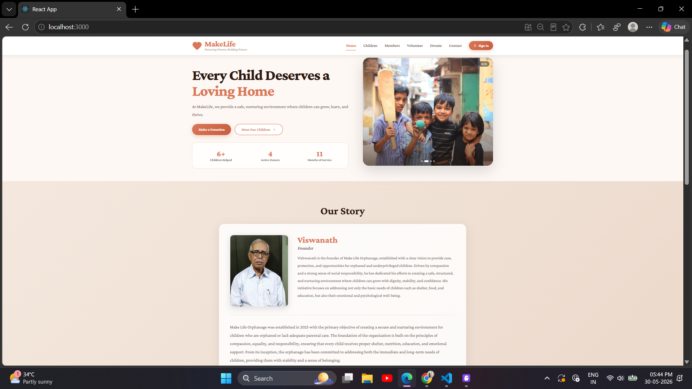 | 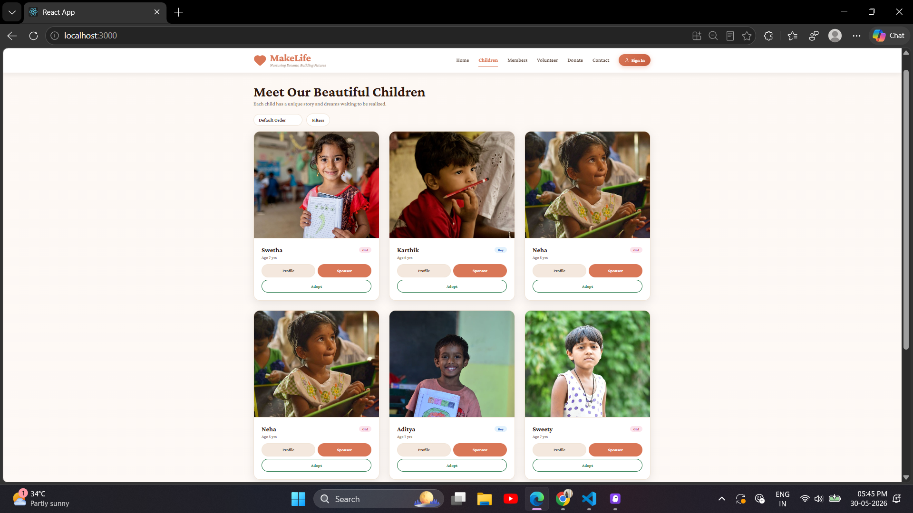 |

| Team Members | Donate |
|---|---|
| 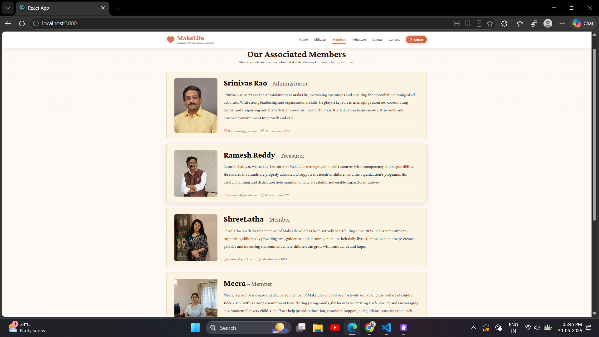 | 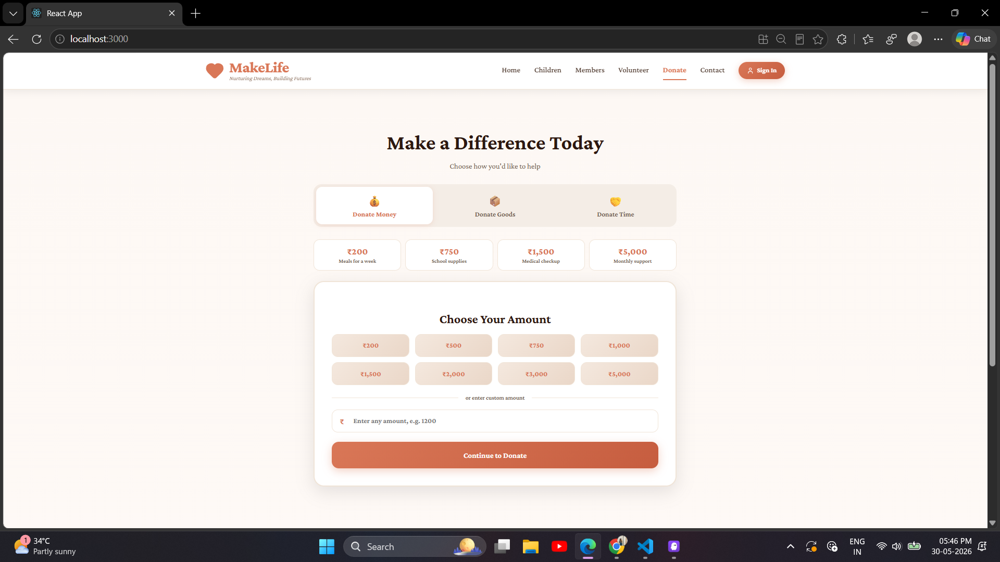 |

| Contact |  |
|---|---|
| 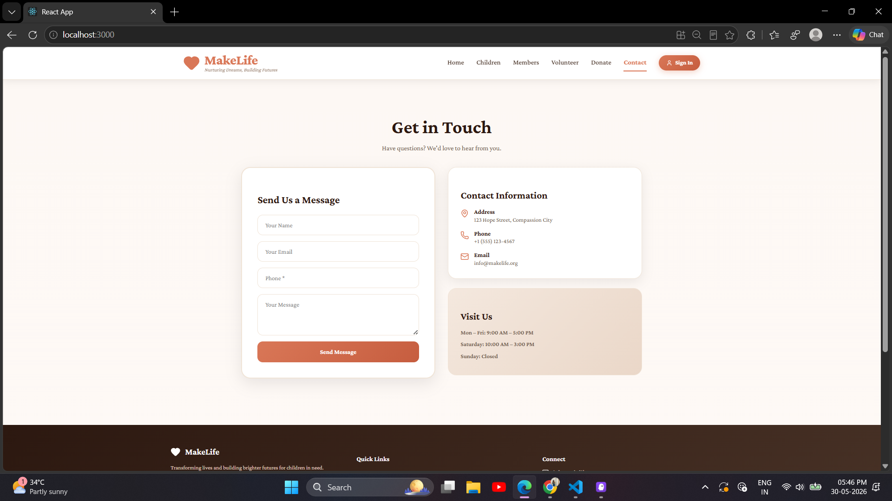 | |

### Admin Dashboard

| Login | Overview |
|---|---|
| 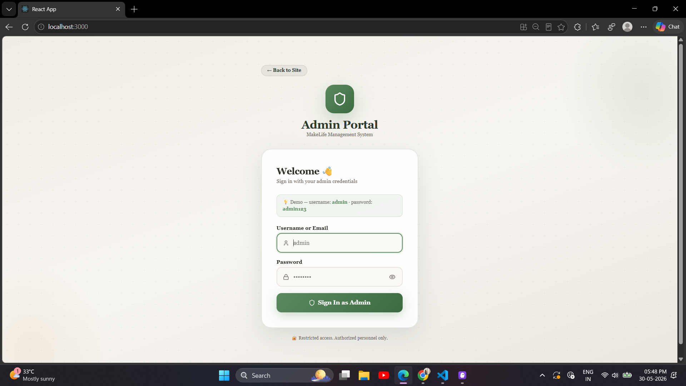 | 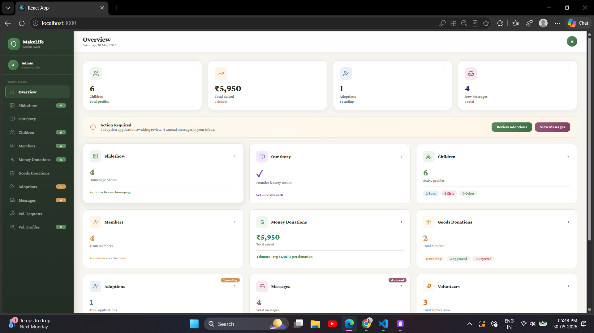 |

| Children Management | Members Management |
|---|---|
| 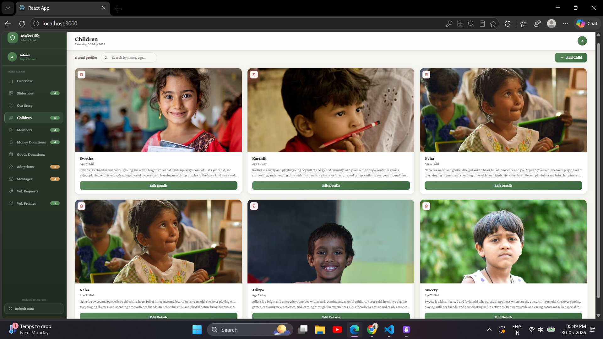 | 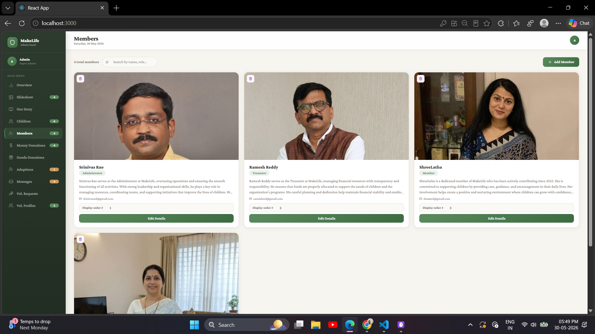 |

| Messages | Donations |
|---|---|
| 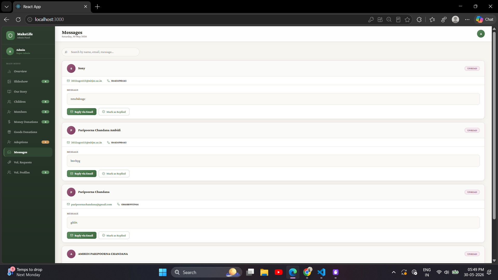 | 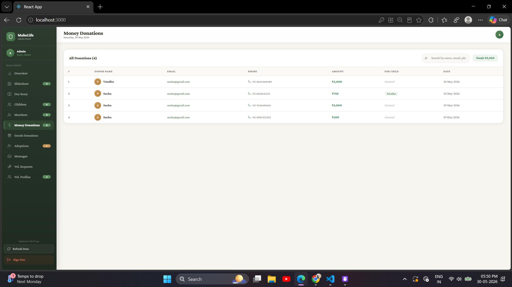 |

---

## 🌍 About

MakeLife is a platform dedicated to making NGO processes more efficient and transparent. It includes:

- **Child Profiles** — Add, update, and manage children available for sponsorship or adoption
- **Donations** — Track monetary and goods donations
- **Adoption Requests** — Submit and manage adoption applications with status tracking
- **Volunteers** — Register and manage volunteer requests
- **Team Members** — Manage NGO team profiles with photos and custom display order
- **Founder Story** — Editable founder section for the public website
- **Slideshow** — Upload and manage homepage slideshow images
- **Contact Messages** — Receive and manage public contact form submissions
- **Admin Dashboard** — Secure admin panel to manage everything in one place

---

## 🚀 Tech Stack

**Frontend** — React.js, Lucide-React, Custom CSS

**Backend** — Node.js, Express.js, MongoDB Atlas, Mongoose, Cloudinary, Multer, bcryptjs, JWT

---

## 🛠️ Running Locally

### Prerequisites
- Node.js v16+
- [MongoDB Atlas](https://www.mongodb.com/atlas) account
- [Cloudinary](https://cloudinary.com) account

### 1. Clone the repo
```sh
git clone https://github.com/Paripoorna7/makelife-mern-project.git
cd makelife-mern-project
```

### 2. Backend Setup
```sh
cd backend
npm install
```

Create `backend/.env`:
```env
PORT=3001
MONGO_URI=your_mongodb_atlas_connection_string
CLOUDINARY_CLOUD_NAME=your_cloud_name
CLOUDINARY_API_KEY=your_api_key
CLOUDINARY_API_SECRET=your_api_secret
JWT_SECRET=your_jwt_secret
ADMIN_USERNAME=admin
ADMIN_PASSWORD=admin123
```

```sh
npm start
```
Backend runs on **http://localhost:3001**

### 3. Frontend Setup
```sh
cd ../frontend
npm install
```

Create `frontend/.env`:
```env
REACT_APP_API_URL=http://localhost:3001
```

```sh
npm start
```
Frontend runs on **http://localhost:3000**

---

## 🔐 Admin Access

Go to **http://localhost:3000** → click **Admin** in the navbar.

```
Username: admin
Password: admin123
```

---

## 📁 Project Structure

```
MakeLife/
├── backend/
│   ├── config/       # Cloudinary configuration
│   ├── models/       # Mongoose models
│   ├── routes/       # Express API routes
│   └── server.js     # Entry point
├── frontend/
│   └── src/
│       └── App.js    # Full React single-page application
└── screenshots/      # Project screenshots
```

---

## 📄 License

Distributed under the MIT License.
